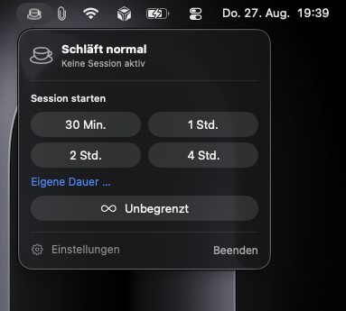

# NoNap

Keeps your Mac awake — even with the lid closed, for a duration you choose.

Click the menu bar icon, choose a duration, and you're done. When the
time runs out, NoNap automatically allows sleep again.

## Screenshot

Click the image to enlarge it.

[](docs/screenshots/menu-bar.png)

## Why two parts?

This is the heart of the matter and the reason the app is built the way
it is.

The usual way to keep a Mac awake — `caffeinate` or an
`IOPMAssertion` — only prevents **idle sleep**. Close the lid,
and the Mac still goes to sleep. This can only be disabled through the
power management setting `SleepDisabled`, which is
root-protected.

That's why NoNap consists of:

| Part | Privileges | Purpose |
|---|---|---|
| **NoNap.app** | Regular user privileges | Menu bar, settings, display |
| **NoNapHelper** | root (LaunchDaemon) | Sets `SleepDisabled`, monitors the deadline |

The helper is deliberately tiny and does nothing else. All of its code lives in
`NoNapHelper/` — seven files you can read through in an afternoon.

It uses `/usr/bin/pmset` instead of undocumented IOKit calls. The symbol
`_IOPMSetSystemPowerSetting` exists in IOKit but is not declared in any
public header — in a process with system privileges, an
undocumented symbol is the worse trade-off. Every step can be checked in the
terminal:

```bash
pmset -g | grep SleepDisabled
```

## Setup

1. **Put the app in a permanent location** — preferably `/Applications`.

   Important: Move it first, then set up the background service. The
   registration remembers the app's path. If it is still in the
   Xcode build folder and that folder is cleared, the service points to nothing.

2. Launch the app. The icon appears on the right side of the menu bar.

3. Open the panel → **Set up background service**. macOS asks once for
   the administrator password.

The service then appears under *System Settings › General ›
Login Items* and can be disabled there at any time.

## Settings

**General**

- Launch NoNap at login
- Show remaining time in the menu bar
- Default duration
- Keep the display awake as well (only works with the lid open)
- Notify when a session ends automatically

**Protection** — the emergency brake

- End the session when the battery is low (adjustable threshold, default 20 %)
- End the session when the power adapter is unplugged

The background service monitors these limits itself. They still apply
if the app has crashed or been quit.

**Background service** — view status, set up, remove

## What happens when something goes wrong

A Mac that no longer goes to sleep, with nobody knowing why, would be
the worst possible outcome. Several safeguards are built in to prevent that:

- **App crashes** → The session continues until its deadline and then ends
  normally. The helper, not the app, keeps the clock.
- **Helper crashes** → launchd restarts it; it reads the saved
  session and restores the correct state.
- **Mac restarts** → `SleepDisabled` survives a restart. The
  helper therefore launches at system startup, detects the restart from the
  boot time, discards the session, and allows sleep again.
- **`SleepDisabled` is changed externally** → A heartbeat checks this every
  minute and restores the expected state.
- **Helper is terminated** (`SIGTERM`, uninstallation) → allows sleep beforehand.
- **App is quit while a session is running** → NoNap asks whether the
  session should end as well.

## Security

The helper runs as root and accepts XPC connections. A Mach service
that any program could access would allow privilege escalation.
That's why **both sides** verify the other side's signature using
`setConnectionCodeSigningRequirement` and `setCodeSigningRequirement`, respectively:

```
identifier "com.johan.NoNap" and anchor apple generic
    and certificate leaf[subject.OU] = "FZL5999DHB"
```

XPC rejects connections that do not meet this requirement before any
NoNap code runs. The team ID is in `Shared/NoNapShared.swift` and must match the
signing identity used for the build.

## Structure

```
NoNap/          App: menu bar, settings, XPC client
NoNapHelper/    Privileged daemon (root)
Shared/         XPC protocol and identifiers, used by both targets
Resources/      LaunchDaemon property list
```

During the build, the helper is copied to `NoNap.app/Contents/MacOS/`, and the
property list to `NoNap.app/Contents/Library/LaunchDaemons/`.

## A note on heat

A Mac under load with the lid closed cannot dissipate heat. For long sessions
with compute-intensive tasks: do not put it in a bag or backpack. The
battery emergency brake helps prevent drained batteries, not heat buildup.

## Build

```bash
xcodebuild -project NoNap.xcodeproj -scheme NoNap -configuration Release build
```

Requirements: macOS 14 or later, a signing identity with the team ID
stored in `NoNapShared.swift`.
